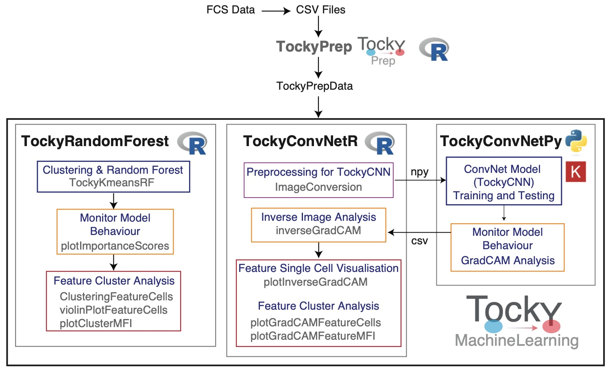
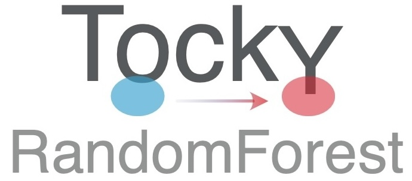

# TockyConvNetR: Machine Learning R Package for Flow Cytometric Fluorescent Timer Analysis (Beta Version)

**Author:** Dr Masahiro Ono  
**Date:** 28 January 2025

The **TockyConvNetR** R package is part of the [**TockyMachineLearning**](https://monotockylab.github.io/TockyMachineLearning/) package suite.

The **TockyMachineLearning** package suite comprises several subpackages designed to facilitate advanced machine learning analyses of flow cytometric data from Fluorescent Timer reporters. Each package within the suite specializes in different aspects of data handling and analysis:

- **TockyRandomForest**: An R package that provides Random Forest analysis tools specifically tailored for processing and interpreting Fluorescent Timer data.
  
- **TockyConvNetR**: An R package focused on data preprocessing and feature cell analysis suitable for Convolutional Neural Network (ConvNet) analyses. This package facilitates image conversion methods for preparing Tocky data and implements Inverse GradCAM Gating Analysis to interpret ConvNet/Grad-CAM outputs.

- **TockyConvNetPy**: A Python package dedicated to performing ConvNet training and conducting Grad-CAM analysis, complementing the R-based preprocessing and analysis tools.

Below is a schematic figure providing an overview of the workflows and interactions within the **TockyMachineLearning** suite.

### Link to GitHub Pages

---

